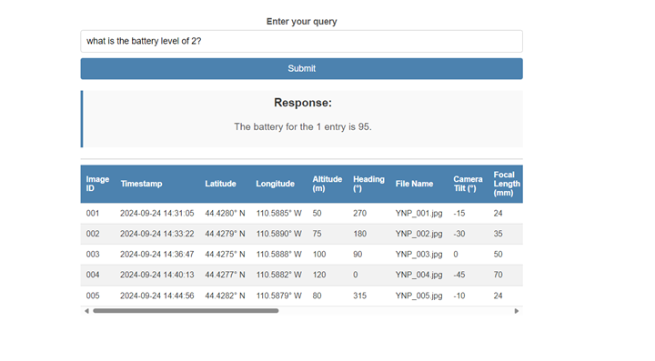

## Local Development

### First-time setup

1. Backend

```shell
<root> % pipenv install
```

2. Frontend

```shell
<frontend> % npm install
```
3. Activate the backend virtual environment

```shell
<root> % pipenv shell
```
4. Run the flask server

```shell
<root> % pipenv run flask run
```

5. Start the frontend React application

```shell
<frontend> % npm start
```


